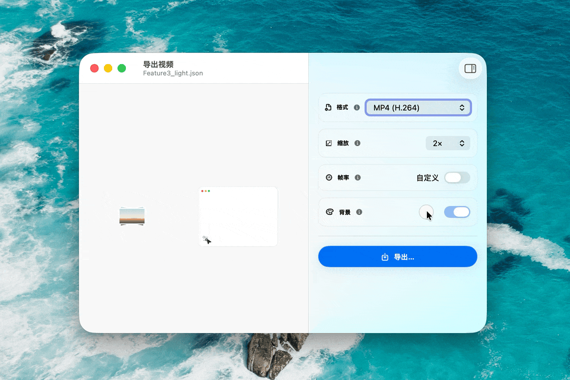
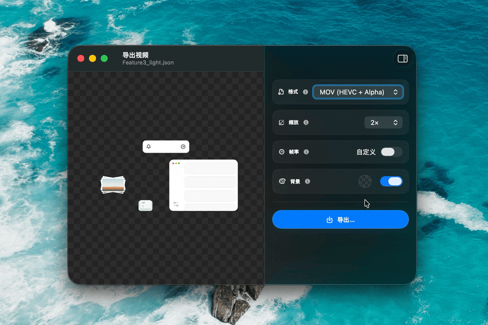

# BlossomColorPicker

A compact SwiftUI color picker forked from
[Lakr233/BlossomColorPicker](https://github.com/Lakr233/BlossomColorPicker).
This fork keeps the original blossom interaction and adds a smaller
export-workflow friendly layout with optional opacity controls.



Opacity-enabled mode:



## Features

- Petal-based color selection with smooth bloom animations
- Works on iOS and macOS
- Simple SwiftUI integration with binding and callback APIs
- Customizable color palette via JSON
- Brightness slider built-in
- Optional mirrored opacity slider for alpha-capable workflows
- Compact arc preview for the current color
- Plain color sample rendering, so glass/material effects do not distort the
  palette values

## Requirements

- iOS 17.0+ / macOS 14.0+
- Swift 6.0+

> **Note:** This picker is designed for pointer-based interaction. Not recommended on iOS or mobile devices without a pointer device (e.g., Apple Pencil, trackpad, or mouse).

## Installation

Add to your `Package.swift`:

```swift
dependencies: [
    .package(
        url: "https://github.com/okooo5km/BlossomColorPicker.git",
        branch: "main"
    )
]
```

Or in Xcode: File → Add Package Dependencies → paste the URL.

## Usage

Basic color selection:

```swift
import BlossomColorPicker
import SwiftUI

struct ContentView: View {
    @State private var color: Color = .blue

    var body: some View {
        BlossomColorPicker(selection: $color)
            .frame(width: 32, height: 32)
    }
}
```

Opacity-enabled selection:

```swift
import BlossomColorPicker
import SwiftUI

struct ContentView: View {
    @State private var color: Color = .blue
    @State private var opacity: Double = 1

    var body: some View {
        BlossomColorPicker(
            selection: $color,
            opacity: $opacity,
            supportsOpacity: true
        )
            .frame(width: 32, height: 32)
    }
}
```

### Callback Style

```swift
BlossomColorPicker(
    initialColor: .orange,
    initialOpacity: 0.8,
    supportsOpacity: true,
    onColorChange: { color in
        print("Color changed: \(color)")
    },
    onOpacityChange: { opacity in
        print("Opacity changed: \(opacity)")
    },
    onDismiss: { finalColor in
        print("Picker closed with: \(finalColor)")
    }
)
```

## How It Works

1. Tap the color swatch to open the picker
2. Drag or tap on petals or the center dot to select a color
3. Use the side slider to adjust brightness
4. Enable `supportsOpacity` to show a mirrored opacity slider on the left
5. Tap empty picker space or click outside to confirm
6. Press Escape on macOS to cancel and restore the previous value

## Release Notes

This fork currently tracks changes on `main` and is used by LottieGo as a
Swift Package dependency. Version tags can be added later once the API surface
settles.

## Credits

This repository is a respectful fork of
[Lakr233/BlossomColorPicker](https://github.com/Lakr233/BlossomColorPicker).
The original project, blossom-shaped picker concept, and base implementation
come from [@Lakr233](https://github.com/Lakr233). The original idea credit is
also kept below, exactly where it belongs.

This fork focuses on the needs of LottieGo's export background color workflow:
compact layout, opacity-aware interaction, and preview assets for that usage.

## License

MIT License - see [LICENSE](LICENSE) for details.

---

Made with care by [@Lakr233](https://github.com/Lakr233), idea from [@lichinlin](https://x.com/lichinlin/status/2019084548072689980).
